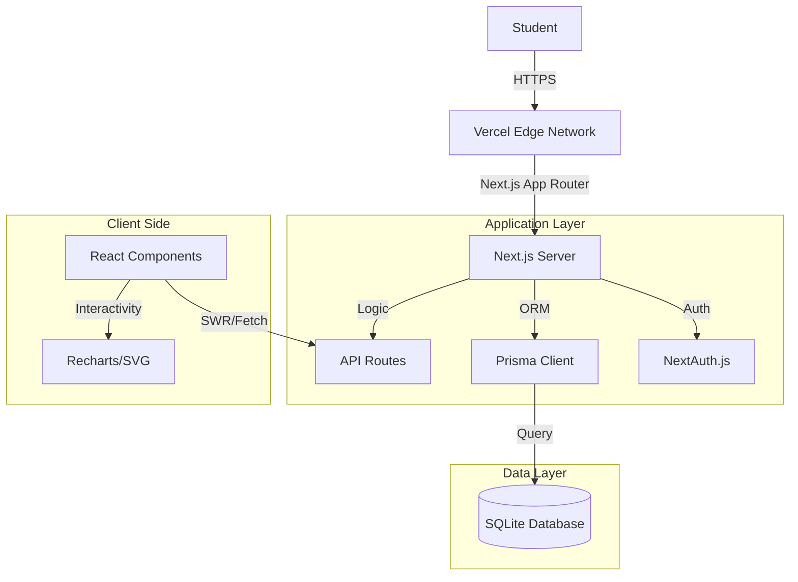

# 🎓 Project Nexus – Campus Super-App

<div align="center">


**A Centralized Digital Ecosystem for Student Life Management**

[Vision](#-vision) • [Architecture](#-architecture) • [Features](#-features-deep-dive) • [Quick Start](#-quick-start) • [Team](#-team)

</div>

---

## 👁️ Vision

**Problem:** Campus life is fragmented. Students juggle between WhatsApp groups for lost items, notice boards for mess menus, clunky ERP portals for attendance, and random emails for announcements.

**Solution:** **Project Nexus** unifies these disconnected experiences into a single, mobile-first "Super App". It's not just a dashboard; it's a proactive assistant that predicts what a student needs next—whether it's the next class location, today's lunch menu, or a summary of a long dean's email.

---


https://github.com/user-attachments/assets/814707ec-4901-408f-bf6c-60afbb9bdb8e


---


---


## 🏗️ Architecture

Project Nexus is built on a modern, type-safe stack designed for performance and developer experience.



### 🛠️ Tech Stack Rationale

| Technology | Why we chose it? |
|------------|------------------|
| **Next.js 16** | For its powerful App Router, Server Actions, and Vercel optimization. |
| **TypeScript** | To ensure type safety and reduce runtime errors during the hackathon. |
| **Tailwind CSS v4** | For rapid UI development and a mobile-first, responsive design system. |
| **Prisma ORM** | For type-safe database queries and easy schema management. |
| **SQLite** | Lightweight, serverless, and perfect for rapid prototyping/hackathon demos. |
| **NextAuth.js** | Secure, flexible authentication strategies. |

---

## 🌟 Features Deep Dive

### 1. `Daily Pulse` – The Morning Briefing
*   **Mess Menu**: Fetches the daily menu dynamically. Highlights "TODAY" automatically.
*   **Mail Summarizer**: A custom Natural Language Processing (NLP) utility that extracts key sentences from long announcements using keyword scoring (Zero-Cost AI).

### 2. `Academic Cockpit` – Performance Central
*   **Smart Timetable**: Shows *only* what's relevant. "Up Next" logic calculates the next class based on current time.
*   **CGPA Visualizer**: Interactive line charts tracking term-by-term performance.
*   **Attendance Health**: Color-coded progress bars (Green > 85%, Red < 75%) for instant status checks.

### 3. `Student Exchange` – Community Marketplace
*   **Lost & Found**: A peer-to-peer board for reporting lost items.
*   **Status Workflow**: Items move from "Reported" → "Resolved" with visual indicators.

### 4. `Nexus Assistant` – Conversational UI
*   A chat interface that helps students navigate the app.
*   *Example Queries:* "What's for lunch?", "Where is my next class?", "I lost my ID card".

---

## 🚀 Quick Start

### Prerequisites
*   Node.js 18+ 
*   npm or bun

### Installation

1.  **Clone the repository**
    ```bash
    git clone https://github.com/shivansh01-24/ProjectNexsus.git
    cd project-nexus
    ```

2.  **Install dependencies**
    ```bash
    npm install
    ```

3.  **Setup Environment**
    ```bash
    cp .env.example .env
    # Edit .env if needed (defaults work for local dev)
    ```

4.  **Initialize Database**
    ```bash
    npx prisma db push
    npx prisma db seed
    ```

5.  **Run Development Server**
    ```bash
    npm run dev
    ```

6.  **Open Dashboard**
    Visit `http://localhost:3000`

---

## 📸 Demo Credentials

For testing the different personas during the hackathon:

| User | Role | Username (UID) | Password |
|------|------|----------------|----------|
| **Rahul Sharma** | Student (CS-A) | `u123456` | `password123` |
| **Priya Patel** | Student (CS-B) | `u123457` | `password123` |
| **Arjun Singh** | Student (ME-A) | `u123458` | `password123` |

---

## �️ Roadmap

- [x] **Phase 1: Core Foundation** (Auth, Dashboard, Timetable)
- [x] **Phase 2: Smart Features** (Mail Summarizer, Analytics Charts)
- [ ] **Phase 3: Community** (Peer-to-Peer Notes Sharing)
- [ ] **Phase 4: Mobile Native** (React Native port)
- [ ] **Phase 5: Payments** (Canteen ordering integration)

---

## 🤝 Contribution

We welcome contributions! Please check [CONTRIBUTING.md](CONTRIBUTING.md) for details.

1.  Fork the Project
2.  Create your Feature Branch (`git checkout -b feature/AmazingFeature`)
3.  Commit your Changes (`git commit -m 'Add some AmazingFeature'`)
4.  Push to the Branch (`git push origin feature/AmazingFeature`)
5.  Open a Pull Request

---

## 👥 Team

<div align="center">
<h3>Team AVAKAYA</h3>
<p><i>"Code with flavor, deploy with spice."</i></p>

| Team Member | Role |
|-------------|------|
| **Member 1** | Full Stack Lead |
| **Member 2** | UI/UX Designer |
| **Member 3** | Backend Specialist |
| **Member 4** | AI/Data Engineer |

</div>

---

<div align="center">
Made with ❤️ by Team AVAKAYA
</div>
